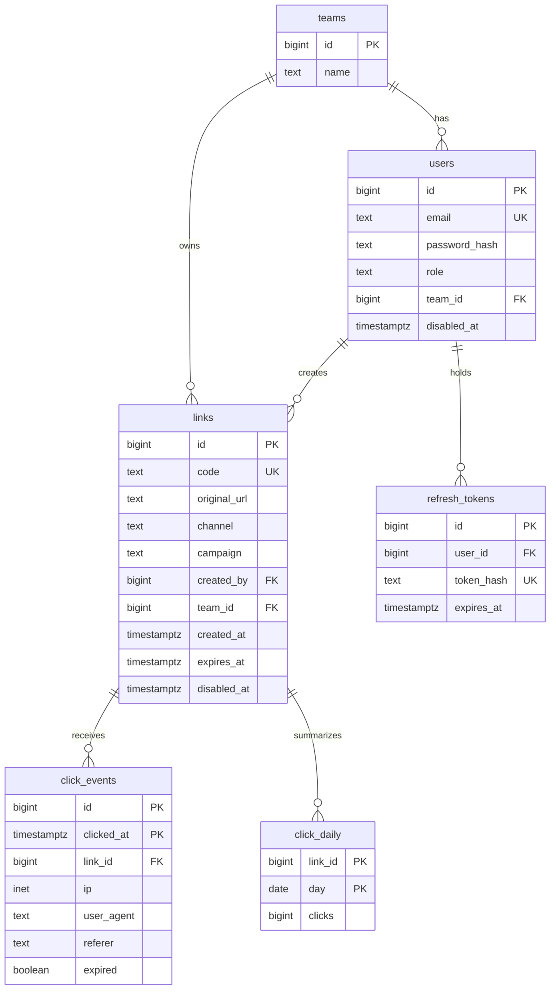

# 系統設計

這份文件收斂短網址服務的需求、容量估算、短碼設計、資料模型、API 與一致性的取捨。各元件的 README 講「這個元件怎麼做」，這份講「整個服務為什麼這樣設計」。

標示「假設」的數字是推估用的起點，不是量測值；拿到實際的使用情形後替換，並重算依賴它的結論。

各項設計的實作順序見 [開發順序](roadmap.md)。快取、非同步點擊寫入、Bloom filter 與資料表分割在這份文件裡寫的是**目標設計**，實作時先用較簡單的做法上線、量出瓶頸，再依開發順序的〈階段七：優化實驗〉逐項加上；各段開頭標明目前的狀態。

## 功能需求

- 把原始網址轉成短網址，可指定管道（簡訊 / Email / 廣告）、活動名稱、到期時間，可選擇自訂短碼。
- 訪客點短網址時轉址到原始網址（`302`）。
- 記錄每一次點擊，後台依連結、活動、管道、時間統計。
- 前台與後台登入，依角色限制可見範圍（見 [auth-and-roles.md](auth-and-roles.md)）。

## 非功能需求

| 項目         | 目標                                         | 說明                                                                 |
| ------------ | -------------------------------------------- | -------------------------------------------------------------------- |
| 轉址延遲     | p99 低於 200 ms（在服務端量，不含訪客網路）  | 壓測時以它界定「可承受的流量」，見 [loadtest](../loadtest/README.md) |
| 轉址可用性   | 高於建立連結與後台                           | 簡訊與廣告發出去就收不回來，轉址壞掉的損失最大                       |
| 點擊數       | 最終一致，延遲幾秒到一分鐘內可接受           | 行銷看的是活動成效，不需要即時到每一次點擊                           |
| 建立連結     | 強一致：短碼唯一，建立後立刻可以轉址          | 行銷建立後通常馬上點一次測試                                         |

## 容量估算

短網址的流量由行銷活動決定，所以估算從活動的形狀出發，而不是從一個整數的 RPS 出發。

### 連結怎麼產生：每個活動一條，還是每個收件人一條

這是影響最大的一個決定，先定下來：

- **每個活動 × 管道一條連結**：同一則簡訊發給所有人的連結都相同。建立量很小，一天幾十條。
- **每個收件人一條連結**：每則簡訊的連結都不同，可以追到「誰點了」。一次發送 50 萬則就要在發送前建立 50 萬條連結，建立量變成批次寫入，而且連結和個人綁在一起，屬於個人資料。

本服務兩種都支援：一般活動用前者；後者走批次建立的 API（`POST /api/links/batch`），由行銷主管以上的角色使用。

### 讀取量（假設）

以一次簡訊活動估算：

- 發送 50 萬則，10% 的人點擊，共 5 萬次點擊。
- 點擊集中在發送後的 10 分鐘，平均每秒約 83 次。
- 最前面的一分鐘最集中，取平均的 10 倍，每秒約 800 次。

廣告與 Email 疊加上去，尖峰抓每秒 1,000 次轉址當設計目標。建立連結（不含批次）遠少於轉址，讀寫比遠大於 10:1。

這個量級遠低於系統設計題常見的「每秒 10 萬次」，差別來自出發點：業務推估出來的數字才對應得到實際要準備的容量。壓測量到的可承受流量（見 [loadtest](../loadtest/README.md)）拿來和這個估算比：量到的高於估算，練習機已經足夠；低於估算，瓶頸那一層就是要改進的地方。

### 儲存量（假設）

- 一般連結：每天 50 條，一年約 1.8 萬條。
- 每個收件人一條：每年 100 次活動 × 50 萬則，一年 5,000 萬條。
- 點擊事件：每年 100 次活動 × 5 萬次點擊，加上廣告，抓每年 1,000 萬筆。逐筆事件保留 90 天，之後只留每日彙總。

## 短碼設計

### 長度

Base62（`0-9a-zA-Z`）每多一個字元，可用的組合乘以 62：

| 長度 | 組合數          |
| ---- | --------------- |
| 6    | 約 568 億       |
| 7    | 約 3.5 兆       |

長度不只看用不用得完，還要看**被猜中的機率**。每個收件人一條的連結和個人綁在一起，攻擊者可以隨機產生短碼去試：有效連結數 ÷ 組合數就是每試一次猜中的機率。

- 5,000 萬條、6 碼：每試一次約 0.09%，試 100 萬次約猜中 900 條。
- 5,000 萬條、7 碼：每試一次約 0.0014%，試 100 萬次約猜中 14 條。

所以一般連結用 6 碼；每個收件人一條的連結用 7 碼，再加上轉址路徑的限流與掃描偵測（見下方〈不存在的短碼〉）。

### 產生方式

| 做法                                  | 優點                         | 缺點                                                                                       |
| ------------------------------------- | ---------------------------- | ------------------------------------------------------------------------------------------ |
| 雜湊原始網址（加使用者 ID）後取前 N 碼 | 同樣的輸入得到同樣的短碼      | 截斷之後會碰撞，要重算；同一個網址用在不同活動也會得到同一個短碼，無法分開統計             |
| 遞增序號轉 Base62                     | 不會碰撞，不必重試            | 短碼連續可猜，掃描者可以依序列舉所有連結；Go 與 Laravel 要共用同一個序號來源                |
| 預先產生一批短碼放在池子裡            | 建立時直接取用，不必查重      | 多一個要維護的元件，池子用完時建立會失敗                                                   |
| **密碼學安全的亂數產生，靠唯一索引擋重複** | 不可預測；兩個後端各自產生也不衝突 | 碰撞時要重試一次                                                                           |

**選用：亂數產生加唯一索引**。

- 兩個後端各自用密碼學安全的亂數產生器（Go 的 `crypto/rand`、PHP 的 `random_int`）產生短碼，寫入時由 PostgreSQL 的唯一索引判斷有沒有重複。重複就重新產生，最多重試 3 次。
- 碰撞機率等於有效連結數 ÷ 組合數，以 6 碼、1.8 萬條估算幾乎為零；就算到 5,000 萬條，也只有 0.09% 的建立需要重試一次。
- 唯一索引是兩個後端共用的仲裁者，所以兩邊的程式不必互相協調。

**同一個網址不合併成同一個短碼**：行銷會把同一個商品頁放在簡訊、Email 與廣告裡，各自要分開統計，所以每次建立都產生新的短碼。

**自訂短碼**：與亂數短碼共用同一個唯一索引，有人先佔用就回 `409`。長度同樣限 6 到 7 碼，只接受 Base62 字元，所以 `api`、`admin` 這類路徑名稱依長度就被排除，不需要另外的保留字清單。

短碼只用 Base62 字元，所以不會和 `/-/` 底下的維運端點同名，見〈健康檢查〉的〈後端的維運端點放在 `/-/` 底下〉；自訂短碼的驗證同樣只接受 Base62 字元。

### 到期之後

- 預設到期時間：90 天（假設，依行銷活動的長度調整）。建立時可以改。
- 到期或被停用的短碼回 `302` 轉到電商首頁，不回錯誤頁：舊簡訊裡的連結還會被點，導到首頁至少留住訪客。這些點擊照樣記錄，標記為「已到期」。
- 短碼不重複使用。舊簡訊與舊廣告還在流通，重用會把舊連結的訪客導到新的目的地。

## 資料模型

- **`click_events` 依 `clicked_at` 分割（partition）**，每月一個分割區；PostgreSQL 要求分割表的主鍵包含分割欄位，所以主鍵是 `(id, clicked_at)`。超過保留期的分割區整個刪除，比逐筆刪除快得多。
- **點擊數不放在 `links` 的計數欄位**：爆紅連結每秒數百次更新同一列，會在那一列上排隊等鎖。點擊先記成事件，再彙總到 `click_daily`。
- **角色只放在 `users.role`**：四個角色是固定的，不需要另一張表；角色變多或要細分權限時再拆。

## API

各服務的路由、端點的 method 與行為、錯誤格式（RFC 9457）、分頁與兩個前端的頁面路由，定在 [API 與路由規格](api.md)。這裡只記影響其他設計的幾個決定：

- 管理 API 只在 `APP_DOMAIN`，需要登入；轉址只在 `SHORT_DOMAIN`，公開。入口 Nginx 只把 6 到 7 碼 Base62 的單段路徑交給後端轉址，其餘路徑在 Nginx 就回 `404`。
- 網址不帶版本號：消費者只有自己的兩個前端，跟後端一起部署。
- 連結以短碼識別，沒有 `DELETE`，只能停用；`original_url` 建立後不能修改。
- 會被客戶端拿回來再送出的值（分頁游標、時間格式）格式寫死，因為同一個使用者的連續請求可能先後落在 Go 與 Laravel。

## 讀取路徑：快取與不存在的短碼

> 狀態：規劃。階段二先直接查 PostgreSQL，作為對照組；快取在階段七加上。

轉址先查 Valkey，查不到再查 PostgreSQL，查到後寫回 Valkey。

### 建立後立刻可以轉址

建立連結時同時寫入 Valkey（write-through），行銷建立後馬上點擊測試時不必等快取回填。之後若加上 PostgreSQL 的唯讀副本，快取查不到的轉址要回主節點查：副本有複寫延遲，剛建立的短碼在副本上可能還不存在。

### 不存在的短碼

> 狀態：規劃。兩層處理在階段七依序加上（先快取「不存在」的結果，短碼掃描情境顯示它擋不住隨機掃描時再加 Bloom filter）。

查不到的短碼每次都會穿過快取打到 PostgreSQL。正常訪客很少打錯，大量不存在的短碼多半是掃描：攻擊者隨機產生短碼來試。兩層處理：

- **快取「不存在」的結果**：查不到時在 Valkey 寫一筆短效期（例如 60 秒）的「不存在」標記，同一個錯誤短碼重複被打時不再查資料庫。建立連結時要刪掉對應的標記，否則自訂短碼剛好撞上標記時，60 秒內會轉址失敗。
- **Bloom filter**：把所有存在的短碼放進 Bloom filter，查詢前先問它；它回答「不存在」就一定不存在，直接回 `404`。它回答「可能存在」才查快取與資料庫，誤判只會多查一次資料庫，不會擋掉真的連結。Valkey 有 Bloom filter 模組可用。Bloom filter 不能移除元素，而本服務的短碼不重複使用、到期後仍要轉首頁，集合只增不減，正好適用。

隨機掃描每個請求都是不同的短碼，第一層擋不住，第二層才擋得住。另外由 Nginx 依來源 IP 限流，並在後台統計 `404` 的比例當作掃描的訊號。

## 點擊事件的寫入

> 狀態：規劃。階段二先在請求內同步寫入，階段七以壓測確認同步寫入拉高轉址延遲後改成非同步。

每次轉址同步寫一筆 `click_events`，尖峰時每秒上千次寫入會和轉址搶 PostgreSQL 的連線。改成非同步：

1. 轉址時把點擊事件推進 Valkey 的 stream，立刻回 `302`。
2. 背景程序每秒從 stream 批次取出，一次寫入多筆到 `click_events`。
3. 另一個排程把 `click_events` 彙總到 `click_daily`。

背景程序是新增的執行單元：Go 版是 `services/go/cmd/worker`，Laravel 版是一個 artisan 指令；兩個實作同時跑時要用 stream 的 consumer group，同一筆事件才只會被其中一個取走。

代價是點擊數最終一致：後台看到的數字會落後幾秒。Valkey 在事件寫進 PostgreSQL 之前掛掉，會遺失那段時間的點擊；要避免就開啟 Valkey 的 AOF 持久化。壓測的「點擊數比對」量的就是這條管道有沒有掉資料。

## 健康檢查

每個容器都有 healthcheck，Gatus 從 compose 網路裡另外探測一次，SSH 進主機時用 `scripts/health.sh` 查。三者的分工與實測行為見 [infra/monitoring](../infra/monitoring/README.md)；這一節記錄的是元件之間要先約定好的部分。

### 兩個後端的健康端點是同一份契約

Go 與 Laravel 都在容器的 `8080` 提供 `GET /-/healthz`：回 `200`、帶 `X-Backend` header。Laravel 內建的健康檢查路由 `/up` 已改成同一個路徑。兩個後端放在同一個 upstream，健康檢查、監控設定與之後的負載平衡器都只寫一份，所以路徑、port 與成功的判定要兩邊一致。

`/-/healthz` 只給 compose 網路裡的 healthcheck 與 Gatus 用，入口 Nginx 不把它開放到 `SHORT_DOMAIN` 或 `APP_DOMAIN`。

### 後端的維運端點放在 `/-/` 底下

轉址 `GET /{code}` 與後端的維運端點在同一個 port 上。`/{code}` 對得到任何**一段**的路徑，所以一段、6 到 7 碼英數字的固定路由會跟短碼同名：`/healthz` 與階段三要加的 `/metrics` 都是 7 碼，本身就是合法的 Base62 短碼。Go 的 `http.ServeMux` 遇到兩者都對得上時交給固定路徑（實測 `/healthz` 進健康檢查的 handler，`/aB3xYz9` 進轉址的 handler），萬一亂數產生了同名的短碼，那條連結永遠轉不了址，也不會報錯。

所以後端的維運端點一律放在 `/-/` 底下：`/-/healthz`、`/-/metrics`，之後的 `/-/readyz` 也一樣。Base62 短碼沒有 `-`，依產生方式就不可能同名，不需要維護排除清單。這個保留前綴有兩條配套：

- **自訂短碼的驗證只接受 Base62 字元**（含 `-` 一律拒絕），否則使用者能自訂出 `-` 開頭的短碼。
- **其他路由不受影響**：前台、後台在 `APP_DOMAIN`，Nginx 不交給 `/{code}`；`/api/links` 這類 API 有兩段，`/{code}` 對不到。要保留的只有和 `/{code}` 共用同一層路徑的那些。

### 健康端點檢查到多深

目前 `/-/healthz` 只證明程序與 HTTP handler 在運作，不檢查 PostgreSQL 與 Valkey。理由是兩者已經各自有 healthcheck，Gatus 也直接探測它們；把依賴放進後端的 `/-/healthz`，資料庫短暫不可用時兩個後端會一起變成 unhealthy，從狀態看不出是哪一層壞了。階段二接上資料庫之後再決定要不要另外提供一個檢查依賴的端點（`/-/readyz`）。

Docker 對 unhealthy 的容器不會重啟，只有程序結束才會依 `restart` 政策重啟；healthcheck 在 compose 裡的作用是顯示狀態與 `depends_on` 的啟動順序。換到會依 healthcheck 重啟容器的平台（例如 Kubernetes 的 liveness probe）時，端點的深度要重新判斷。

### 對外的狀態頁

上面這些都是對內的檢查，給工程師與自動化系統看，回答「哪個實例、哪個依賴壞了」。給使用者看的對外狀態頁是另一樣東西，回答「我要用的功能現在能不能用」。目前的使用者是內部行銷團隊，點短網址的訪客不需要知道服務狀態，所以不做。

**觸發條件**：開放給外部客戶自己建立短網址，或對外承諾可用率（SLA）。兩者任一成立，客戶就需要一個在出事時查得到狀態的地方。

**到時候的設計**：

- **依使用者認得的功能分組**：轉址、建立連結、後台報表，而不是 Go、Laravel、PostgreSQL 這些元件。一個元件壞掉影響哪些功能，由人判斷後對應過去。
- **事故公告由人發布**：內部監控（Gatus 的告警）通知值班的人，確認影響範圍後再更新狀態頁並寫說明。不把健康檢查的結果直接接上去：實例短暫失敗又被重啟時使用者沒有受影響，直接顯示會讓燈號一直閃。可以另外加從外部對 `SHORT_DOMAIN` 發轉址請求的探測，自動顯示轉址的可用率。
- **放在主系統以外**：獨立的網域與主機，不依賴這個專案的 Nginx、資料庫或雲端帳號。狀態頁最需要可用的時候是主系統壞掉的時候；2017 年 AWS S3 故障時，AWS 的狀態儀表板因為管理後台依賴 S3 而無法更新，就是同一個依賴關係。
- **內部的健康端點仍然不對外開放**：`/-/healthz` 帶的是實例層級的資訊，從外面打只會隨機落在其中一個後端，也會讓外人知道內部的元件組成。

## 一致性與可用性的取捨

| 路徑         | 取捨                                                                 |
| ------------ | -------------------------------------------------------------------- |
| 轉址         | 偏可用性：PostgreSQL 掛掉時，快取裡有的短碼照常轉址                  |
| 建立連結     | 偏一致性：短碼唯一由資料庫保證，PostgreSQL 掛掉就無法建立            |
| 點擊統計     | 最終一致：經由 stream 非同步寫入                                     |
| 登入驗證     | JWT 驗簽不依賴資料庫；使用者層級的撤銷紀錄在 Valkey，Valkey 掛掉時照常放行、立即撤銷暫時失效（最多 15 分鐘後 access token 自然過期） |

## 擴展的方向

練習環境不需要，記下來作為容量不夠時的順序：

1. **讀取**：應用程式實例水平增加；PostgreSQL 加唯讀副本分擔統計查詢。
2. **轉址與管理分開部署**：短網域的流量只交給一組專門處理轉址的實例，後台的重查詢不會影響轉址。
3. **點擊事件**：已經依時間分割；寫入量再大就換成專門的事件管道（例如 Kafka）。
4. **分片（sharding）**：連結數到億級以上才需要，依短碼的雜湊分片，轉址只要查一個分片。
